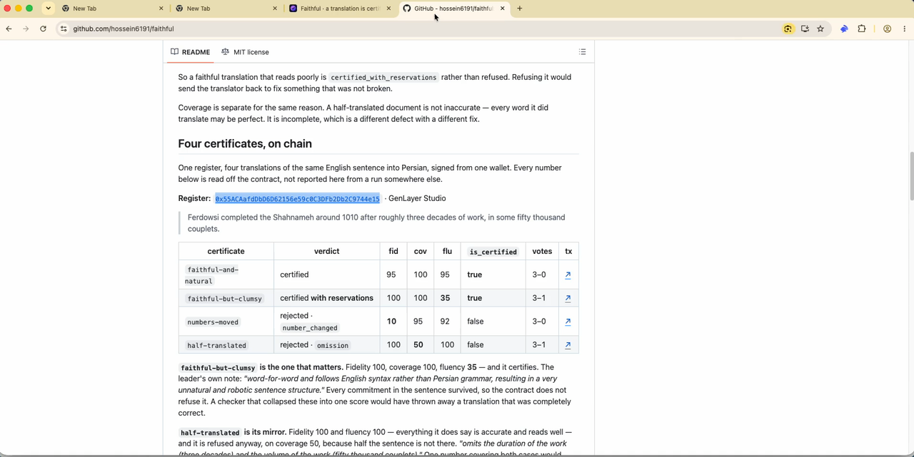

# Faithful

**A translation is certified only when it carries the same commitments.**

Three axes, judged separately because they fail differently. The model reports
what it finds; it is never asked whether the translation passes. That decision is
made in code, with thresholds every validator applies to its own reading.

```
certify("acme-fa", "English", "Persian", source, translation)

  → every validator reads both texts and scores three things independently
  → each derives the verdict from the same thresholds, in ordinary code
  → they settle only if they reached the same verdict
  → is_certified("acme-fa")   free, deterministic, readable by another contract
```

## Demo

Seventy-six seconds, no cuts: connect, load the register, paste the pair, sign, watch the
validators vote, read the certificate on the explorer.

[](https://github.com/hossein6191/faithful/blob/main/assets/demo.mp4)

*Click the picture to play it on GitHub, or [download the file](https://github.com/hossein6191/faithful/raw/main/assets/demo.mp4).*

## The failure this exists to prevent

A bad translation being waved through.

That happens when a model is asked to decide, because a lenient reader can
approve on its own. So it is not asked. The prompt says so outright — *"Report
what you find. Do NOT decide whether it passes — that is not your decision to
make."* — and the gate lives in `_verdict()`, in Python, where anybody can read
it and every validator applies the same numbers.

## Three axes, and only two of them may refuse

| axis | what it asks | blocks |
|---|---|---|
| **fidelity** | do the numbers, dates, names, obligations and negations survive | below 85 |
| **coverage** | how much of the source is present at all | below 85 |
| **fluency** | does it read like the language, or like a machine | **never** |

A translation can be ugly and safe, or fluent and wrong. Collapsing those into
one score is how the second one gets published: a fluent mistranslation scores
well on the thing readers notice and badly on the thing that matters.

So a faithful translation that reads poorly is `certified_with_reservations`
rather than refused. Refusing it would send the translator back to fix something
that was not broken.

Coverage is separate for the same reason. A half-translated document is not
inaccurate — every word it did translate may be perfect. It is incomplete, which
is a different defect with a different fix.

## Six certificates, a publisher, a manifest and a host, on chain

One register, one English source (a short terms-of-service passage) and its
translations into Persian, every transaction signed from the author's wallet
`0x0A9fd8Fe0b041974e8F794fCf3Eed352c14cf5fe` on 13 September 2026. Every number
below is read off the contract, not reported here from a run somewhere else. The
deployed source is byte-identical to `contracts/faithful.py` (sha256
`4f2545e44f4bfd989455709f2415e968607ee24ffb734d4ddf49d2b80642483b`, checked with
`gen_getContractCode`) and passes `genvm-lint check` when pulled off the chain.

**Register:** [`0xA989Df25f7b94c6c7dA29EAeBFC4C97A0B6E20Cb`](https://explorer-studio.genlayer.com/address/0xA989Df25f7b94c6c7dA29EAeBFC4C97A0B6E20Cb)
· GenLayer Studio · [deploy ↗](https://explorer-studio.genlayer.com/tx/0x48ceaf59787555f009320bb3e3cb825b99ad18f6d7c7e000f51a6c75f9b037a8)

> Acme Cloud charges 20 USD per seat each month. Overage is billed at 0.10 USD per gigabyte. Invoices are due within 14 days. We may change these terms with 30 days notice. Support requests are answered within 2 business days.

Before anything was judged, the author published the source's hash under their
own address ([`publish` ↗](https://explorer-studio.genlayer.com/tx/0x3d73ec4322263501ec23e6f5d3b6d421cee6abb4ab20761d31a2837ad3b097bd),
`source_hash 6530eef7…`, title *Acme Cloud terms of service*), so every
certificate over that source below lists `0x0A9fd8Fe…` among its publishers.
Nobody is "the" publisher: a second wallet may publish the same hash (see the
last table), and a consumer asks `is_published_by` for the address it trusts.

| certificate | verdict | fid | cov | flu | `is_certified` | votes | pair hash | tx |
|---|---|---|---|---|---|---|---|---|
| `faithful-and-natural` | certified | 100 | 100 | 100 | **true** | 3–0 | `74de75e8…` | [↗](https://explorer-studio.genlayer.com/tx/0xd8c618fd424d5e935de0f607795aa4902d24e30568179b98d8f0f76c8a1ad267) |
| `faithful-but-clumsy` | certified **with reservations** | 95 | 100 | **30** | **true** | 3–0 | `6367e8b6…` | [↗](https://explorer-studio.genlayer.com/tx/0xbc1940f996429a6df0a246d89d5d49dd4f15ec3a444d810c934880d2f3a4c0eb) |
| `numbers-moved` | rejected · `number_changed` | **20** | 100 | 95 | false | 3–0 | `77b00bf0…` | [↗](https://explorer-studio.genlayer.com/tx/0x6d63a65533366467fe56c5afa86c4ac74608e360ebd5788b10927029597d0a18) |
| `half-translated` | rejected · `omission`, `untranslated` | 100 | **35** | 30 | false | 3–2 | `6f915f2d…` | [↗](https://explorer-studio.genlayer.com/tx/0x4339235b3ac2b1c6a9701c3d1f7dd3f659a2ac91743d3a0637c103f71eba454d) |
| `terms-part-1` | certified | 99 | 100 | 97 | **true** | 3–0 | `18502a70…` | [↗](https://explorer-studio.genlayer.com/tx/0xe180a2948c0c348ece9cc9dca86c0ef02f4f169d22a9be25502994394b903e55) |
| `terms-part-2` | certified | 100 | 100 | 100 | **true** | 3–0 | `898bdd71…` | [↗](https://explorer-studio.genlayer.com/tx/0xf5f1f0eb8638969a3a008c01e5b47fafea0d5020bc32a1d1d305c647c7c8f83a) |

Then three more transactions. The first two asked no model anything; the third
asked every validator to fetch a file.

| step | votes | result | tx |
|---|---|---|---|
| `manifest("acme-terms-in-two-parts", [part-1, part-2])` | 5–0 | `manifest_hash 8a43f0b5…`, **certified_now: true** | [↗](https://explorer-studio.genlayer.com/tx/0x8ad1e1dee39467163530d93975941e2da4c5103815c3afb2f2f814249dda441f) |
| `certify` the faithful pair again under a new name | 3–0 | **refused**: *this exact source and translation are already certified as faithful-and-natural; a certificate is not asked for twice* | [↗](https://explorer-studio.genlayer.com/tx/0x124e746af968aaae1fbcfb09913e2eec40c90ff7e8224f5c65aaede7799f3199) |
| `bind_domain("faithful-one.vercel.app")` | 3–0 | every validator fetched [`/.well-known/faithful.json`](https://faithful-one.vercel.app/.well-known/faithful.json) and found the author's address: **bound**; `is_bound(0x0A9fd8Fe…, faithful-one.vercel.app)` is true | [↗](https://explorer-studio.genlayer.com/tx/0x5469d9493621cb9517522fc4f2232347ce86ebc104c39f5b6a85d16d1959e84a) |

And from a second wallet, `0x449ab0B80539A6358d6a78664221de0A1d96C65A`, which
the well-known file does not name:

| step | result | tx |
|---|---|---|
| `publish` of the same source hash | accepted: two publishers on the row, neither authoritative | to be added |
| `bind_domain("faithful-one.vercel.app")` | **refused by the validators**: *faithful-one.vercel.app does not name 0x449ab0B8… in /.well-known/faithful.json* | to be added |

**`faithful-but-clumsy` is the one that matters.** Fidelity 95, coverage 100,
fluency **30**, and it certifies. Every commitment in the passage survived
(20 USD, 0.10 USD, 14 days, 30 days, 2 business days) in a word-for-word
rendering that no Persian reader would write. A checker that collapsed these
into one score would have thrown away a translation that was completely correct.

**`half-translated` is its mirror.** Fidelity 100, everything it does say is
accurate, and it is refused anyway, on coverage 35, because four of the five
sentences are still in English. One number covering both cases would have to
call these two documents similar. They are opposites.

**`numbers-moved` is what the whole thing is for.** 20 USD became 35 USD and
30 days notice became 7. Fluency 95: it reads perfectly. That is exactly why
fluency cannot be allowed to decide anything.

**The manifest is the document.** The same passage was judged again in two
parts, and `is_document_certified(8a43f0b5…)` is true because both parts
passed. `terms-part-1` and `terms-part-2` list no publishers: nobody published
the hashes of the halves, and the contract does not pretend otherwise.

**The host is the provenance.** A signature can only say "this wallet claims
these bytes". The binding says what the validators checked: the site's owner
put this address in a file only they can write. A bounty that names the
publisher and the host pays only when both hold.

Read any of it back without spending a transaction:

```
gl.get_contract_at(addr).view().is_certified_hash("74de75e8…")                     → true
gl.get_contract_at(addr).view().is_document_certified("8a43f0b5…")                 → true
gl.get_contract_at(addr).view().is_published_by("0x0A9fd8Fe…", "6530eef7…")        → true
gl.get_contract_at(addr).view().is_bound("0x0A9fd8Fe…", "faithful-one.vercel.app") → true
gl.get_contract_at(addr).view().certificate("half-translated")                      → the scores, defects, hashes and publishers
gl.get_contract_at(addr).view().texts("numbers-moved")                              → the exact pair judged
```
## What validators must agree on

The verdict each of them derives on its own, first and always. Numbers alone
would let a leader on 86 and a validator on 80 agree "within eight" while
standing on opposite sides of an 85 threshold.

Then only what is still load-bearing:

- **On a rejection**, the two must name at least one defect in common — not the
  same list. `omission` and `untranslated` are two names for one half-finished
  document.
- **A score below its floor is not compared at all.** Both readers have already
  agreed the translation falls short there, and how far short is not a fact this
  contract acts on.

This is not a preference. The first version compared everything exactly and an
obviously-distorted translation drew **1 agree, 3 disagree** — every reader
called it rejected for the same reason, and they split over whether its fidelity
was 30 or 55. Same inputs, same model, rule narrowed: **3 agree, 0 disagree.**

The notes are free text and are never compared.

## The six defects

A closed set, so validators compare an exact vocabulary rather than prose:

```
number_changed     a number, amount, date or quantity differs from the source
negation_flipped   something the source affirms is denied, or the reverse
name_changed       a name, place, product or identifier differs
omission           a material part of the source is missing
addition           the translation states something the source does not
untranslated       substantial parts are left in the source language
```

## Built for fifteen communities and English, open to any language

`communities()` publishes the Discord communities **and the language each label
actually means** — because "Latam", "Nigerian", "Bangladeshi" and "Hindi-Urdu"
are community names, not languages, and two validators handed `"Latam"` would
otherwise be free to read it differently.

```
English · Chinese · Hindi-Urdu · Indonesian · Latam · Nigerian · Russian · Korean
Turkish · Ukranian · Vietnamese · Arabic · Persian · German · Japanese · Bangladeshi
```

Fifteen of those have their own channel in the GenLayer Discord. English is the
sixteenth, as the language every passage is written in.

Any other language string is passed through untouched, so this works for the
ones nobody has added yet.

**Numerals in another script are the same number.** Persian ۲۰, Arabic ٢٠,
Bengali ২০ and Chinese 二十 are twenty. Half the communities above write numbers
that way, and a checker that read them as different values would refuse most
correct translations — reporting `number_changed`, which is exactly the defect a
reader would trust. The prompt says so, and the test fixtures are written in
Persian numerals so the assertion is real rather than decorative.

## What it is for

- **Community translations of anything that carries obligations** — terms,
  announcements, governance proposals, safety notices — where a moved number is
  a different promise.
- **A gate before publishing**: `is_certified(name)` is a view, so another
  contract reads it with `gl.get_contract_at(addr).view().is_certified(name)`
  and pays nothing for consensus. `contracts/fixtures/bounty.py` is that
  contract, below.
- **A record that survives the argument.** `texts(name)` publishes exactly what
  was judged, so a certificate can be checked rather than trusted.

## Bound to what was judged, not to a name

A certificate's name is a label anybody could have typed. Its identity is what
the validators actually read:

```
source_hash = sha256(source text as stored)
target_hash = sha256(translation as stored)
pair_hash   = sha256("faithful-pair", source language, target language, source_hash, target_hash)
```

Every certificate carries all three, `is_certified_hash(pair_hash)` is the gate
by identity, and the same pair is never judged twice: a second `certify` over
identical bytes is refused with the name of the certificate that already holds
them — a certificate is not asked for until the answer suits.

**Publishers, and why none of them is "the" publisher.** `publish(source_hash,
title)` puts a source hash on the record under the caller's own address. It is
a row keyed by that address and the hash: any number of accounts may publish the
same hash, nobody wins a race, and nobody is in anybody's way. A row is a wallet's
assertion, nothing more, and the register never names one publisher as the
authoritative one. A consumer that relies on provenance brings the address it
trusts and asks `is_published_by(address, source_hash)`; `publishers_of(hash)`
lists everyone who claimed it, in order of arrival, and a certificate lists them
live.

**Hosts, checked by the validators.** A publisher can say more than "this is
mine": `bind_domain(host)` makes every validator fetch
`https://host/.well-known/faithful.json` itself and read whether its
`publishers` list names the sender. Only a yes binds; a no is a stored refusal
with the reason. `is_bound(publisher, host)` then answers for free, and a bounty
may require it. That turns provenance from something a wallet signs into
something several nodes checked against a file only the host's owner can put
there. This site vouches for the addresses listed in
[`/.well-known/faithful.json`](https://faithful-one.vercel.app/.well-known/faithful.json);
a wallet the file does not name is refused by the validators.

**Documents in parts.** A long text is judged in parts — the contract caps each
side at 4,000 characters — and a document is a `manifest(name, [pair_hash, …])`:
an ordered list of the parts' pair hashes. Nothing about the document is stored
as a verdict; `is_document_certified(manifest_hash)` reads every part's
certificate at the moment it is asked and is true only when all of them passed.
`document()` shows each part's live state, including parts not judged yet.

The site computes the same hashes in the browser, prints them next to every
certificate, and verifies a pair hash against the register with one free read.

## The consequence: a bounty that can only pay a certified translator

A contract that records a verdict and stops has produced an opinion.
`contracts/fixtures/bounty.py` is the other half: a requester opens a bounty
for one **pair hash** (or one **document manifest**) in one register, may name
the publisher whose source it must be and the host that publisher must be bound
to, funds it, and binds the translator's wallet. `settle()` asks the
register, through ordinary synchronous views with no model and no consensus,
what it already decided, and obeys it once:

```
certified, and the named publisher did publish the source (and is bound to the host, if one was named)  → the translator is paid
rejected by the validators                                                                             → the requester is refunded
nothing under that hash yet, or certified but the named publisher has not published the source
or is not bound to the host yet                                                                        → nothing happens; try later
```

The register never tells the bounty who the publisher is. The requester says
which address it trusts, and the register only answers whether that address
published these bytes and whether its host vouches for it. Provenance is a
reason to wait, never to refund: a certified translation is the translator's
work, and only the validators' rejection sends the money back.

There is no path through it that pays for a translation the validators
refused, and `would_pay()` says what `settle()` will do before anybody signs.

`tests/on_chain/bounty.mjs` runs it against the register above: a bounty on the
clumsy-but-faithful pair pays its translator — reservations still certify — a
bounty on the moved-numbers pair sends the money back to the requester, a bounty
naming the wrong publisher pays nobody but the requester, a document bounty on
the two-part manifest pays the translator, and a bounty on a hash that has no
certificate refuses to settle and keeps the funds. It also proves the refusal
path refunds rather than strands: value sent with a refused payable call is not
returned by the chain, so the contract returns it itself and says why.

## Reading a certificate

```
certify(name, source_lang, target_lang, source, translation)   the one call that costs consensus
publish(source_hash, title)                                    a source hash under the caller's own address; several may
bind_domain(host)                                              the validators check https://host/.well-known/faithful.json names the caller
unbind_domain()                                                the caller takes its own binding back, no validator needed
manifest(name, [pair_hash, …])                                 a document judged in parts

is_certified(name) -> bool             the gate; reservations still certify
is_certified_hash(pair_hash) -> bool   the gate by identity
is_document_certified(manifest_hash)   true only when every part passed
certificate(name) · certificate_hash(pair_hash)
                                       verdict, three scores, defects, submitter, hashes, publishers
texts(name)                            the exact pair that was judged
document(manifest_hash)                every part's live state, with each part's source hash and publishers
is_published_by(publisher, source_hash)   did THIS address publish these bytes
publishers_of(source_hash)             everyone who did, in order of arrival, with their host if bound
publication(publisher, source_hash)    one publisher's row: title, time, host
is_bound(publisher, host) · domain_of(publisher)
                                       what the validators checked against the host's well-known file
communities()                          the sixteen labels and the language each means
rules()                                the gate, the agreement rule, and the bindings
names() · manifests_list()             what this register holds
```

`rules()` publishes the thresholds and the comparison, so nobody has to read the
source to know what a certificate means. The site does not print it — a wall of
raw JSON is not something anybody reads on the way past — but it does call it:
an address that cannot answer `rules()` is refused as a register with a free
read, rather than costing a signature to find out. Studio's RPC sometimes
answers a read with *Contract not found* for an address the explorer shows
perfectly well, for a minute at a time; reads therefore retry eight times over
about forty seconds, and if the demo register still cannot be read the site
shows a snapshot of it taken from the chain (`data/snapshot.json`, made by
`tools/snapshot.mjs`), labelled as such, with every row linking to the explorer.

## The site

Live at **<https://faithful-one.vercel.app>**. Two modes.

**Guided** picks your community and hands you one of ten short English passages
about that community's own history — no repeats until you have seen all ten.
`texts.js` holds all 160. Here **the source language cannot be set**: it is
English, fixed by the passage, and the box is read-only. That is not a
simplification. A label a reader can change independently of the text will
eventually disagree with it, and this page was built after a round came back
`UNDETERMINED` for exactly that reason — a target of Hindi-Urdu selected over an
English-to-Persian pair, which the leader called "fluent Urdu" and the
validators would not.

**Any pair** takes both texts and both languages from you, which is how the four
certificates above were made. The protection there is different: the language is
still chosen from the list rather than typed, so the label always names a real
language, and a script check warns before signing when the text does not look
like the language it is filed under.

**Only those sixteen are supported, and the page says so rather than letting
somebody find out after a signature.** Choosing anything else is allowed —
the contract takes any language string — but there are no passages for it, no
marker on the globe, and the page states all of that the moment the language is
picked, in either mode. Keeping the working set that size is what keeps the page
light; the other sixty-one are still searchable, and are labelled in the list as
having neither.

**Which key signs is the reader's choice, not the page's.** Every wallet in the
browser announces itself under EIP-6963, so pressing Connect lists them by name
and icon rather than picking one — the old code took Rabby if it saw it and the
first announcement otherwise, which is a silent decision about whose key signs.
Connect again to switch, Disconnect to drop it. The page also follows
`accountsChanged`, because an address printed here that is not the one signing
is worse than no address at all. Disconnecting leaves the register loaded:
reading it is free and needs no wallet, so it takes away signing and nothing
else.

The language list is searchable by the names people actually type. "Farsi",
"Mandarin", "Bengali", "Naija" and "Mexico" all find the right community, which
they did not until every entry was given its other names and the countries it is
spoken in.

For the mismatches a script check can still catch, the page warns before
anything is signed: paste Arabic script under a German label and it says so, and
says what will happen if you sign anyway.

Both boxes carry `dir="auto"`, so the browser takes writing direction from the
text itself rather than from a list of languages somebody remembered to update —
Persian, Arabic and Urdu lay out right-to-left without being named anywhere.

Scores are coloured on a scale rather than by a label: green at the top, through
amber, to red — so 42 and 85 do not look alike.

## Tests

```
pip install -r requirements-dev.txt && pytest tests/ -q     17 tests, no network, under a second
python tools/mutate.py                                       15 defences removed in turn, each killed by a named test
genvm-lint check contracts/faithful.py

npm ci                                                       genlayer-js 1.1.8 and viem 2.56.3, from the lockfile
node tests/on_chain/smoke.mjs                                the four cases, publishers, the host binding both ways, hashes and manifests, 36 checks against real validators
node tests/on_chain/bounty.mjs                               the consequence, 21 checks against the register above
```

The offline suite covers the gate, the parsing, the prompt boundary, the
bindings, the clock and two static rules over the source: every write records
its sender, and everything interpolated into the prompt is a `_fence()` call or
a name the contract owns. `tests/MUTATIONS.md` is generated, and the generator
refuses to write it if any mutant survives.

The four are the whole argument: a faithful translation certifies, a moved price
is rejected and named, a half-translated document is caught by coverage rather
than fidelity, and **a clumsy but correct translation is not rejected**. The last
one is the point — a checker that refuses ugly-but-safe work is as wrong as one
that certifies fluent-but-false work.

`DECISIONS.md` records what was measured, including the agreement rule that had
to be narrowed and the run that forced it.

## Credits

The globe draws [Natural Earth](https://www.naturalearthdata.com/) 110m land
polygons, public domain, kept in `data/` rather than fetched from a third-party
URL at page load. Projection by [d3-geo](https://github.com/d3/d3-geo).

---

MIT licensed.
